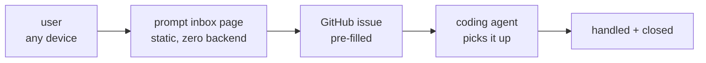

<div align="center">

[](https://www.npmjs.com/package/prompt-inbox)
[](https://github.com/BartoszOsiej/prompt-inbox/pkgs/container/prompt-inbox)
[](https://bartoszosiej.github.io/prompt-inbox/)

[](LICENSE)
[](https://scorecard.dev/viewer/?uri=github.com/BartoszOsiej/prompt-inbox)

**Remote prompt inbox for the coding agent.**

</div>



> [!TIP]
> **No tokens, no backend, no database** — the page simply pre-fills
> `issues/new?title=…&body=…`.

## 📺 Demo


<!-- VHS auto-rendered — run: vhs demos/prompt-inbox.tape -->


## How it works

1. Open [bartoszosiej.github.io/prompt-inbox](https://bartoszosiej.github.io/prompt-inbox/)
2. Pick a project, type a prompt, hit **Submit**
3. A pre-filled GitHub issue opens in the browser
4. The coding agent picks it up, handles it, and closes the issue

<details>
<summary><b>🤖 Agent instructions</b></summary>

When the user says something like *"check the inbox"*:

1. Read **open issues**: `https://api.github.com/repos/BartoszOsiej/prompt-inbox/issues?state=open`
2. Each issue has: **title** `[Project] summary`, **body** with the prompt
3. Handle the prompt in the relevant project repo, then **close the issue**
4. Reply to the user in the chat with what was done

</details>

<details>
<summary><b>⚙️ Form behaviour & quick start</b></summary>

- `index.html` is a single self-contained static page (no build step)
- Submit opens a pre-filled new-issue URL in a new tab
- Issue title: `[Project] <first 60 chars of the prompt>`
- Body contains full prompt, project, context, timestamp

```bash
# Local dev
python3 -m http.server 8080

# Docker
docker build -t ghcr.io/bartoszosiej/prompt-inbox:latest .
docker run -p 8080:80 ghcr.io/bartoszosiej/prompt-inbox:latest
```

Pages publishes from `main` — push and the site updates automatically.

</details>

---

<div align="center">

**Part of [BartoszOsiej](https://github.com/BartoszOsiej)'s agent workflow**

MIT © 2026 Bartosz Osiej

</div>
